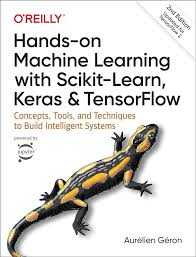

## Yohann Zapart - Reconversion Data Engineer/Scientist

Professeur mathématiques certifié pendant 8 ans, ingénieur en instrumentation scientifique de formation et titulaire d'un master 2 en microélectronique, je décide aujourd'hui de professionnaliser ma passion pour la programmation qui rythme ma vie personnelle, universitaire et professionnelle depuis l'âge de 10 ans et me forme de manière autodidacte au data engineering et à la data science.

Certified mathematics teacher for 8 years, trained as a scientific instrumentation engineer and holder of a Master's degree in microelectronics, I am now deciding to professionalize my passion for programming, which has been a significant part of my personal, academic, and professional life since the age of 10. I am self-teaching myself in data engineering and data science.

<a href="https://www.linkedin.com/in/yohann-zapart/">

 linkedin.com/in/yohann-zapart/

</a>

### Stack :

</td>

<table>
    <tbody>
        <tr>
            <td><strong>Python</strong>
            <td>POO, DSA (<a href="https://www.codingame.com/profile/1931552bce1ef7afebc50c827e8d4b6a0342335" target="_blank">top 1% codingame.com</a>), pip/conda, Jupyter, Venv, Flask, Numpy, Pandas, Matplotlib, Seaborn, Scrapy, Requests, Selenium, BeautifulSoup et d'autres.</td>
        </tr>
        <tr>
            <td><strong>SQL</strong></td>
            <td>JOINs, CTEs, Temporary functions, Window functions, Subqueries, Indexes, LAG, RANK, manipulation des dates</td>
        </tr>
        <tr>
            <td><strong>Linux & Bash</strong></td>
            <td>Automatisation, Terminal, navigation/gestion de fichiers, droits admins/chmod, SSH, oh-my-zsh.</td>
        </tr>
        <tr>
            <td><strong>GCP</strong></td>
            <td>gcloud CLI, BigQuery, Storage, Dataproc, Composer, Dataflow, GCE, Functions, Scheduler, Pub/Sub, IAM, Artifact Registry, Cloud Run, Logging.</td>
        </tr>
        <tr>
            <td><strong>Docker</strong></td>
            <td>Dockerfile, docker-compose, DockerHub</td>
        </tr>
        <tr>
            <td><strong>Spark</strong></td>
            <td>Implementation en local, Docker & GCP Dataproc, pySpark, SparkSQL, Dataframes, Spark Streaming, Jupyter, Spark connectors w/ Maven dependecies.</td>
        </tr>
        <tr>
            <td><strong>Airflow</strong></td>
            <td>Local, Docker & GCP Composer, DAGs, GCP Operators (BigQuery & Storage).</td>
        </tr>
        <tr>
            <td><strong>Kafka</strong></td>
            <td>Local, Docker & GCP Pub/Sub, Producer/Consumer shell/python client, Authentifications, Autorisations ACL.</td>
        </tr>
        <tr>
            <td><strong>En cours</strong></td>
            <td>Scikit-Learn, Looker</td>
        </tr>
    </tbody>
</table>

:book:

### Practiced Technologies :

  - Java, PHP, Javascript, React, Node, HTML/CSS
  - MatLab, LabView
  - Arduino/ESP, Raspberry Pi
  - BASIC / ASM

# Portfolio :

## V'lille GCP 

[:link: github.com/yzpt/vlille_gcp](https://github.com/yzpt/vlille_gcp)

Exploring GCP services through the implementation of an ETL of data from the [V'lille API :link:](https://opendata.lillemetropole.fr/explore/dataset/vlille-realtime/information/?flg=fr-fr&disjunctive.libelle&disjunctive.nom)

Cloud Functions, Pub/Sub, Scheduler, Storage, Dataproc & BigQuery.

Deployment of a [dashboard](https://dashboard-service-dxpal7wuuq-od.a.run.app/) on Cloud Run with Flask, Docker, Google Maps JS, ChartJS.

[https://dashboard-service-dxpal7wuuq-od.a.run.app/](https://dashboard-service-dxpal7wuuq-od.a.run.app/)

## Streaming cluster with Docker, Kafka, Spark & Cassandra

[:link: https://github.com/yzpt/docker_cluster_streaming](https://github.com/yzpt/docker_cluster_streaming)

A project where I discovered and learned:
*Docker and the deployment of a VM cluster with docker-compose
*Kafka: shell and python client, SASL/PLAIN authentications, and ACL authorizations
*Spark: shell and python client, Dataframes, Spark Streaming, Kafka and Cassandra connectors
*Maven: dependencies, repositories, Spark operators for Kafka and Cassandra. I faced several compatibility issues between the versions of Spark, Scala & Kafka used in Docker images.

I enjoyed the Ops aspect of the job, which led me to strongly focus on Kubernetes, which I have begun to get to grips with.

Implementation of SASL/PLAIN authentication and ACL authorizations on Kafka.    

[:link: https://github.com/yzpt/upw_test_kafka_spark_docker](https://github.com/yzpt/upw_test_kafka_spark_docker)
  

## Docker + Airflow + PostgreSQL   GCP Composer + BigQuery 

[:link: https://github.com/yzpt/airflow_carburants](https://github.com/yzpt/airflow_carburants)

ETL of fuel prices with Airflow in three versions:

* Local
* Docker + Airflow + PostgreSQL
* GCP Composer + BigQuery

## Zapmaths: web application for practicing calculation skills

[:link: https://github.com/yzpt/zapmathss](https://github.com/yzpt/zapmaths)

Application developed and used during my career as a certified mathematics teacher in a vocational high school.

Developed during lockdown with a foundation in Php/mySQL on a LAMP server. It reignited my interest in coding and led me to use Python.

It was an effective learning tool, well-received and heavily used by students who each processed thousands of questions per academic year.
* Detailed tracking of student activities
* Questions with semi-random numerical data, the statements, diagrams, charts, and corrections are dynamically generated based on the generated values.
* Web application in Php/mySQL on a LAMP server.

### Démo :
A version is accessible at [https://zapart.ovh](https://zapart.ovh)

Login information:

| login | password |
|-------|----------|
| demo01 | demo01 |
| demo02 | demo02 |
| ... | ... |
| demo99 | demo99 |

## Others & in progress

* [:link: Discovering Machine Learning on the V'Lille GCP project dataset](https://github.com/yzpt/vlille_machine_learning)
* [:link: Implémentation of a Spark Operator on Kubernetes](https://github.com/yzpt/spark_on_kubernetes)
* [:link: Kafka : KRaft mode](https://github.com/yzpt/kafka_kraft)
* [:link: GCP Dataflow & BigQuery, fuel prices](https://github.com/yzpt/dataflow_carburants)
* [:link: Websocket Streaming to GCP Pub/Sub](https://github.com/yzpt/websocket_to_gcp_pubsub)
* [:link: Timemap of stations V'lille](https://github.com/yzpt/timemap_vlille)
* [:link: SASL/PLAIN and ACLs on Kafka](https://github.com/yzpt/upw_test_kafka_spark_docker)
* [:link: Elegant & smooth Arduino adressable Led Strip ws2812b NeoPixel](https://github.com/yzpt/ws2812b)
