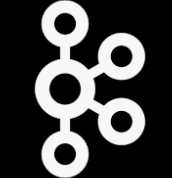

## Yohann Zapart - Reconversion Data Engineer 

La programmation est une passion qui rythme mes loisirs, formations et professions depuis plus de 20 ans. Après une carrirère d'enseignant en mathématiques, je décide aujourd'hui de professionnaliser ce centre d'intérêt et me forme de manière autodidacte au métier de data engineer.

<a href="https://www.linkedin.com/in/yohann-zapart/">

 linkedin.com/in/yohann-zapart/

</a>

### Stack :

</td>

<table>
    <tbody>
        <tr>
            <td><strong>Python</strong>
            <td>POO, DSA (<a href="https://www.codingame.com/profile/1931552bce1ef7afebc50c827e8d4b6a0342335" target="_blank">top 1% codingame.com</a>), pip/conda, Jupyter, Venv, Flask, Numpy, Pandas, Matplotlib, Seaborn, Scrapy, Requests, Selenium, BeautifulSoup et d'autres.</td>
        </tr>
        <tr>
            <td><strong>SQL</strong></td>
            <td>JOINs, CTEs, Temporary functions, Window functions, Subqueries, Indexes, LAG, Coalesce, concatenation, dates PostgreSQL, MySQL, local & Docker.</td>
        </tr>
        <tr>
            <td><strong>Linux & Bash</strong></td>
            <td>Automatisation, Terminal, navigation/gestion de fichiers, droits admins/chmod, SSH, oh-my-zsh.</td>
        </tr>
        <tr>
            <td><strong>GCP</strong></td>
            <td>gcloud CLI, BigQuery, Storage, Dataproc, Composer, Dataflow, GCE, Functions, Scheduler, Pub/Sub, IAM, Artifact Registry, Cloud Run, Logging.</td>
        </tr>
        <tr>
            <td><strong>Docker</strong></td>
            <td>Dockerfile, docker-compose, DockerHub</td>
        </tr>
        <tr>
            <td><strong>Spark</strong></td>
            <td>Implementation en local, Docker & GCP Dataproc, pySpark, SparkSQL, Dataframes, Spark Streaming, Jupyter, Spark connectors w/ Maven dependecies.</td>
        </tr>
        <tr>
            <td><strong>Airflow</strong></td>
            <td>Local, Docker & GCP Composer, DAGs, GCP Operators (BigQuery & Storage).</td>
        </tr>
        <tr>
            <td><strong>Kafka</strong></td>
            <td>Local, Docker & GCP Pub/Sub, Producer/Consumer shell/python client, Authentifications, Autorisations ACL.</td>
        </tr>
        <tr>
            <td><strong>En cours</strong></td>
            <td>Kubernetes, Looker / PowerBI.</td>
        </tr>
    </tbody>
</table>

:book:

### Technos pratiquées :

 

  - Java, PHP, MatLab, LabView
  - Javascript, React, Node
  - Web : HTML / CSS / React
  - Arduino/ESP, Raspberry Pi
  - BASIC / ASM

# Portfolio :

## V'lille GCP 

[:link: github.com/yzpt/vlille_gcp](https://github.com/yzpt/vlille_gcp)

Découverte des services GCP à travers l'implémentation d'un ETL des données de l'[API du service V'lille :link:](https://opendata.lillemetropole.fr/explore/dataset/vlille-realtime/information/?flg=fr-fr&disjunctive.libelle&disjunctive.nom)

Cloud Functions, Pub/Sub, Scheduler, Storage, Dataproc & BigQuery.

Déploiement d'un [dashboard](https://dashboard-service-dxpal7wuuq-od.a.run.app/) sur Cloud Run avec Flask, Docker, Google Maps JS, ChartJS.

[https://dashboard-service-dxpal7wuuq-od.a.run.app/](https://dashboard-service-dxpal7wuuq-od.a.run.app/)

## Cluster de streaming avec Docker, Kafka, Spark & Cassandra

[:link: https://github.com/yzpt/docker_cluster_streaming](https://github.com/yzpt/docker_cluster_streaming)

Projet dans lequel j'ai découvert et appris:
* Docker et le déploiement d'un cluster de VM avec docker-compose
* Kafka : le client shell et python, les authentifications SASL/PLAIN et les autorisations ACLs
* Spark : le client shell et python, les Dataframes, Spark Streaming, les connecteurs Kafka et Cassandra
* Maven : les dépendances, les repositories, les operators Spark pour Kafka et Cassandra. J'ai fait face à plusieurs problèmes de compatibilité entre les versions de Spark, Scala & Kafka utilisées dans les images Docker.

Implémentation de l'authentification SASL/PLAIN et autorisations ACL sur Kafka.

[:link: https://github.com/yzpt/upw_test_kafka_spark_docker](https://github.com/yzpt/upw_test_kafka_spark_docker)
  

## Docker + Airflow + PostgreSQL   GCP Composer + BigQuery 

[:link: https://github.com/yzpt/airflow_carburants](https://github.com/yzpt/airflow_carburants)

ETL des prix des carburants avec Airlfow en trois déclinaisons :

* Local
* Docker + Airflow + PostgreSQL
* GCP Composer + BigQuery

## Zapmaths : application web d'entraînement aux automatismes de calculs

[:link: https://github.com/yzpt/zapmathss](https://github.com/yzpt/zapmaths)

Application développée et utilisée durant ma carrière de professeur certifié de mathématiques en lycée professionnel.

Développée durant le confinement avec des bases en Php/mySQL sur serveur LAMP. Elle m'a amenée à utiliser Python et relancer mon intérêt pour le code.

Elle fût un performant levier d'apprentissage, appréciée et très utilisée des élèves qui traitaient chacun en moyenne quelques milliers de questions par année scolaire.

* Suivi précis des activités des élèves

* Questions aux données numériques semi-aléatoires, les énoncés, schémas, diagrammes et corrections sont générés  dynamiquement en fonction des valeurs générées.
  
* Utilisation de matplolib et mathjax pour générer les énoncés, schémas, graphiques et diagrammes.
* 
* Web application en Php/mySQL sur serveur LAMP.

### Démo :
Une version est accessible sur [https://zapart.ovh](https://zapart.ovh)

Identification:

| login | password |
|-------|----------|
| demo01 | demo01 |
| demo02 | demo02 |
| ... | ... |
| demo99 | demo99 |

## Arduino : smooth adressable LED strip

[:link: https://github.com/yzpt/ws2812b](https://github.com/yzpt/ws2812b)

Exemple de projet ayant été conduit auprès d'élèves.

https://github.com/yzpt/ws2812b/assets/140260395/834fdeff-d45a-46db-ba1b-3e91130749b2

## Autres & en cours

* [:link: Implémentation d'un Spark Operator sur Kubernetes](https://github.com/yzpt/spark_on_kubernetes)
* [:link: Kafka : KRaft mode](https://github.com/yzpt/kafka_kraft)
* [:link: GCP Dataflow & BigQuery, prix des carburants](https://github.com/yzpt/dataflow_carburants)
* [:link: Websocket Streaming vers GCP Pub/Sub](https://github.com/yzpt/websocket_to_gcp_pubsub)
* [:link: Timemap des stations V'lille](https://github.com/yzpt/timemap_vlille)
* [:link: SASL/PLAIN et ACLs sur Kafka](https://github.com/yzpt/upw_test_kafka_spark_docker)